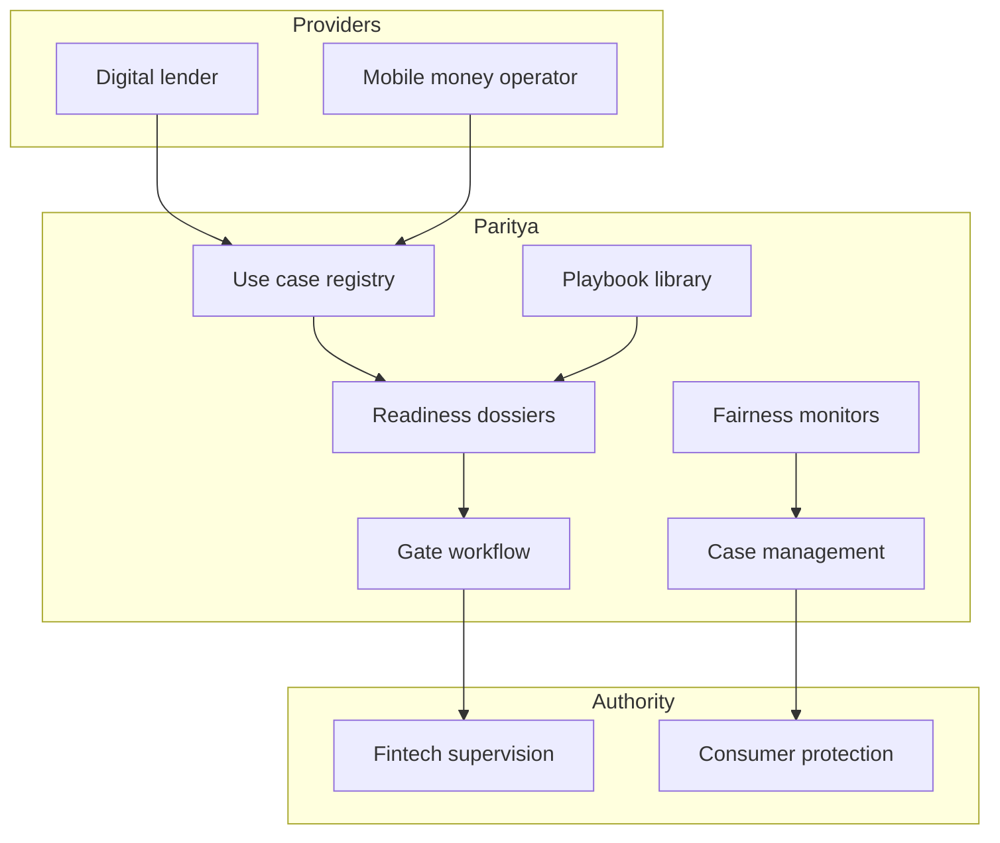

# Paritya

**Source:** `ai-in-financial/AI_Report_WF/`
**Domain:** `ai-fin`
**One-liner:** A supervisory readiness and fairness-governance workspace that helps financial regulators and inclusive-finance providers in low- and middle-income countries assess, gate, and monitor AI used for credit, payments, and digital advice before scaled rollout.
**Wedge:** Central banks, financial inclusion units, and licensed digital lenders / mobile-money operators in LMICs deploying AI for thin-file credit, conversational banking, or fraud—without OECD-centric ethics toolkits that ignore local infrastructure and exclusion risks.
**Positioning:** Sector supervisory AI readiness for inclusive finance. The Web Foundation paper shows AI discourse is universalising while LMIC contexts are not; Paritya turns that thesis into an operational readiness gate—not a generic AI ethics PDF.

## Market research synthesis

### Thesis from source

The World Wide Web Foundation’s June 2017 paper, adapted from Future Advocacy research funded by the Ford Foundation, argues that almost all AI impact literature focuses on high-income countries even though opportunities and risks often hit harder in low- and middle-income countries. It defines intelligent systems as those that take the best possible action in a situation, and stresses that data, algorithms, and AI interact with socio-legal frameworks in ways that can entrench inequality if left ungoverned.

On the opportunity side, the paper documents concrete financial-inclusion uses: Nigeria’s Kudi.ai using NLP for conversational mobile banking for users who cannot navigate browser banking; African micro-credit platforms using AI to measure risk without traditional credit footprints, plus fraud detection and operational optimisation; and expectations that AI can improve national statistics needed for economic planning. On the risk side, the World Bank Development Report 2016 estimates that the share of occupations susceptible to significant automation is higher in lower-income countries (e.g. Ethiopia 84.9% unadjusted / 43.9% adjusted; India 68.9% / 42.6%; Nigeria 65.0% / 40.2%) than the OECD average, and that distributional impacts initially move against inclusiveness. Interviewees warn that high-income AI systems fail when local practices are not digitally encoded, that black-box decisions are unseen by those they affect, that privacy “anonymisation” promises break down, and that global AI ethics initiatives under-represent developing-world actors.

The product insight is supervisory and provider readiness: before an AI credit or advice model touches excluded populations, someone must evidence data representativeness, consent and purpose limitation, local language/access constraints, human appeal paths, displacement and gender impacts, and whether the enabling governance institutions exist. Paritya is that readiness and ongoing monitoring system of record.

### Buyer & economic model

- **Primary buyer:** Head of Financial Inclusion / Fintech Supervision at a central bank or ministry, or Chief Risk/Compliance at a licensed digital lender or mobile-money operator.
- **Users:** supervisors and policy analysts, model risk officers at providers, consumer-protection teams, civil-society observers (read-only where permitted), donor/program officers funding AI inclusion projects.
- **Budget owner / value metric:** supervisory program budget or provider model-risk budget. Value metric is share of AI use cases with completed readiness gates before production, and reduction in unfair-outcome complaints or forced rollbacks.
- **Competing status quo:** ad-hoc pilot approvals by email; imported vendor ethics checklists; no structured evidence of thin-file bias, language access, or appeal rights; post-hoc scandal response.

### Domain constraints

- **Regulatory / trust / safety:** consumer credit and payments licensing; data protection regimes that may be nascent; political sensitivity of automated exclusion; need for South-South policy learning rather than copy-paste GDPR theatre.
- **Data sensitivity:** credit files, mobile-money graphs, and demographic proxies are extremely sensitive; readiness evidence should prefer aggregated fairness metrics and attestations over raw sample export.
- **Change-management realities:** limited government technical capacity (named in the source); providers will not halt revenue pilots without a proportionate gate; Paritya must support phased sandboxes and time-boxed exceptions with expiry.

## Business requirements

- BR-1: Every in-scope AI use case (credit scoring, conversational advice, fraud blocks, collections prioritisation) must have a registered readiness dossier before production traffic.
- BR-2: Dossiers must capture data provenance, population coverage gaps (gender, language, geography, informal sector), and known measurement flaws—not only model accuracy.
- BR-3: Providers must declare human appeal and override paths for adverse automated decisions, with measured time-to-resolution targets.
- BR-4: Fairness and exclusion monitoring must run on an agreed schedule post-launch, with threshold breaches opening supervisory or internal cases.
- BR-5: Sandbox approvals must be time-boxed with explicit exit criteria; expired sandboxes cannot silently remain in production.
- BR-6: Supervisors must be able to request evidence packs without receiving raw customer-level datasets by default.
- BR-7: Local language and literacy constraints for customer-facing AI (e.g. conversational banking) must be tested and recorded before scale claims.
- BR-8: Cross-border model imports must flag training-population mismatch risks when models were built primarily on high-income data.
- BR-9: Displacement and labour-impact notes for automation touching call centres or branch roles must be attached where the use case automates customer-facing labour.
- BR-10: Civil-society or ombuds access (where policy allows) must be able to view non-confidential readiness summaries for accountability.
- BR-11: All gate decisions—approve, conditional, reject, revoke—must be immutable and attributable to a named authority.
- BR-12: The platform must support South-South playbook sharing of anonymised readiness patterns without exposing firm secrets.

## User stories

Canonical user stories live in sibling [USER_STORIES.md](USER_STORIES.md).

## System design

### Overview

Paritya is a multi-tenant readiness and monitoring workspace. Providers register AI use cases, attach evidence, run checklist gates, and publish monitoring metrics. Supervisors review, condition, approve, sandbox, or revoke. Ongoing monitors open cases on threshold breach. Shared playbooks spread LMIC-relevant patterns without requiring raw data exchange.

### Actors & boundaries

- **Actors:** supervisory authority, licensed provider, consumer-protection unit, optional civil-society viewer, donor observer.
- **Trust boundary:** supervisory decisions are authoritative and immutable; providers write evidence into their tenancy; cross-tenant sharing is aggregated or template-only unless explicitly authorised.
- **Human-in-the-loop points:** every production gate; sandbox extension; revoke; fairness-case adjudication.

### Core capabilities

1. **Use-case registry** — credit, advice, fraud, collections, stats/support.
2. **Readiness dossiers and checklists** — LMIC-specific evidence requirements.
3. **Gate workflow** — approve / conditional / reject / sandbox / revoke.
4. **Fairness and exclusion monitoring** — scheduled metrics and breaches.
5. **Appeal and explanation registry** — customer redress paths by model version.
6. **Case management** — supervisory and internal investigations.
7. **Playbook library** — South-South anonymised patterns.
8. **Evidence pack export** — supervisor-ready without default raw PII.

### Conceptual data

- **Primary entities:** UseCase, ReadinessDossier, ChecklistItem, GateDecision, SandboxPermit, MonitoringMetric, FairnessBreach, AppealPath, Case, Playbook, EvidencePack.
- **Critical events:** dossier submitted, gate decided, sandbox expired, metric breached, case opened/closed, pack exported.
- **Retention / audit needs:** gate decisions and dossiers retained for the supervisory record period; monitoring time series retained for trend analysis; personal samples minimised and purpose-limited.

### Integrations (conceptual)

- **Systems of record:** licensing registers, provider model inventory, complaint systems.
- **Upstream signals:** model registries, fairness metric pipelines, sandbox telemetry summaries.
- **Downstream actions:** licence conditions, public summaries, remediation orders, donor reporting.

### High-level architecture

### Success metrics

- **Leading:** % of AI use cases with complete dossiers before production; sandbox expiry compliance; median gate cycle time; monitoring on-time rate.
- **Lagging:** unfair-outcome complaint rate; forced rollbacks; supervisory remediation orders; share of population groups with measured coverage in thin-file models.

## OpenAPI skeleton

Canonical HTTP surface lives in sibling [openapi.yaml](openapi.yaml). Summary:

- **Base path:** `/v1/...`
- **Auth:** `X-API-Key` for provider metric submission; Bearer JWT for supervisors and officers.
- **Resource groups:** UseCases, Dossiers, Gates, Monitoring, Cases, Playbooks, EvidencePacks.
