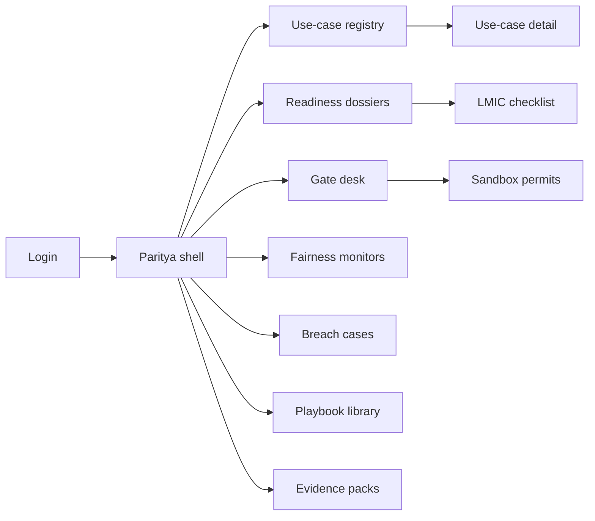
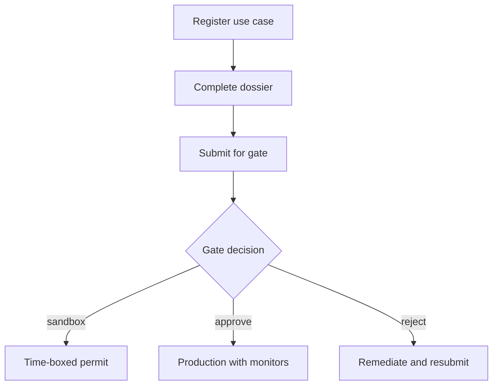

# Paritya — Web app

**Product:** [PRODUCT.md](./PRODUCT.md)
**Primary surface:** Supervisory readiness workspace (provider dossiers + supervisor gate desk under one Paritya shell)
**Secondary surfaces:** Civil-society readiness summary portal (read-only, non-confidential); donor program rollup (aggregated)
**Design thesis:** Paritya is a customs gate for inclusive-finance AI—not an ethics PDF viewer and not a bank fraud or credit console. The metaphor is a border checkpoint for models entering excluded populations: sun-washed clay ground, indigo stamp pads for immutable gate decisions, saffron for expiring sandboxes, and deep green for monitoring that is on time. Coverage gaps (gender, language, geography, informal sector) read as missing stamps on a passport, not as vanity accuracy charts. The Paritya wordmark is an indigo seal on every gate so authorities and providers share one record of who was allowed to scale.

## UX research synthesis

### Category peers (best-in-class)

- **Monetary Authority / FCA-style regulatory sandbox portals:** Time-boxed permits with exit criteria. Steal: sandbox expiry that cannot silently remain in production (BR-5); reject high-income-only checklist tone.
- **OECD AI / NIST AI RMF documentation UIs (adapted carefully):** Structured risk dossiers. Steal: dossier completeness before production (BR-1); reject copy-paste GDPR theatre that ignores LMIC infrastructure (source thesis).
- **World Bank / CGAP inclusive-finance M&E dashboards:** Coverage and exclusion metrics for thin-file populations. Steal: aggregated fairness monitors and population-gap fields (BR-2, BR-4); reject raw PII sample exports to supervisors (BR-6).
- **Collibra-style policy gate workflows:** Immutable approve/conditional/reject with attribution. Steal: named-authority gate stamps (BR-11); reject builder self-approve patterns from MLOps factories.

### Patterns to adopt / reject

- **Adopt:** Use-case registry as home; LMIC checklist (language, literacy, thin-file, cross-border mismatch); sandbox clocks; fairness breach cases; appeal-path registry; South-South playbooks; evidence packs without default raw data.
- **Reject:** Aegira investigator queues; Lendora accept/decline seals as the product; Aetherlab GPU inventory; purple “AI for good” marketing chrome; OECD-only ethics widgets as the only template.

### Trust, density, and workflow constraints from PRODUCT.md

Limited government technical capacity: proportionate gates, phased sandboxes, templates for first-time filers. Providers will not halt revenue pilots without clear obligations—conditional approvals with monitoring metrics. Supervisors must not receive raw customer-level datasets by default (BR-6). Firms cannot edit supervisory decisions (admin SoD).

## Information architecture

### Nav model

### Roles → default home

| Role | Default home | Why |
|------|--------------|-----|
| Financial inclusion supervisor | Gate desk | Approve/condition/revoke before scale |
| Provider model-risk officer | Readiness dossiers | Evidence thin-file and proxies |
| Consumer-protection officer | Breach cases + appeal registry | Complaint themes → model versions |
| Conversational banking PO | Language-access checklist | Before nationwide claims (BR-7) |
| Civil-society viewer | Public readiness summaries | Accountability (BR-10) |
| Platform admin | Tenancy + playbooks | Supervisor≠provider edit rights |

### Cross-links to OpenAPI resources

| Nav area | OpenAPI tags / resources |
|----------|---------------------------|
| Registry | UseCases |
| Evidence / checklists | Dossiers |
| Approve / sandbox / revoke | Gates |
| Post-launch metrics | Monitoring |
| Fairness investigations | Cases |
| South-South patterns | Playbooks |
| Supervisor exports | EvidencePacks |

## Screen inventory

### Use-case registry

- **Purpose:** Every in-scope AI use case (credit, advice, fraud blocks, collections) registered before production traffic.
- **Entry:** Supervisor and provider shared home variant.
- **Layout regions:** Brand + tenancy switcher; registry table (type, stage, gate status, sandbox clock); coverage-gap summary chips; alerts for expired sandboxes still serving.
- **Primary actions:** Register use case; open dossier; jump to gate; flag silent production.
- **Empty / loading / error:** Empty = playbook-guided first filing; error = sync with licensing register.
- **BR / story ties:** BR-1; supervisor stories.

### Readiness dossier

- **Purpose:** Capture provenance, population coverage gaps, measurement flaws—not only accuracy.
- **Entry:** From registry; provider default work surface.
- **Layout regions:** Checklist (gender, language, geography, informal sector); provenance; thin-file notes; cross-border mismatch flag; labour-displacement note; completeness meter.
- **Primary actions:** Attach evidence; mark item N/A with justification; submit for gate.
- **Empty / loading / error:** Incomplete required items block submit (BR-2).
- **BR / story ties:** BR-2, BR-8, BR-9.

### Language and literacy access tests

- **Purpose:** Record conversational/access tests before scale claims.
- **Entry:** From dossier for advice/conversational use cases.
- **Layout regions:** Language matrix; literacy/channel constraints; test results; nationwide claim lock until pass.
- **Primary actions:** Upload test pack; certify languages; unlock scale claim.
- **Empty / loading / error:** Untested language = cannot claim coverage (BR-7).
- **BR / story ties:** BR-7; conversational PO story.

### Gate desk

- **Purpose:** Immutable approve / conditional / reject / sandbox / revoke by named authority.
- **Entry:** Supervisor default.
- **Layout regions:** Queue of submitted dossiers; decision stamp pad; conditions editor; attribution; prior decision history (read-only).
- **Primary actions:** Stamp decision; set conditions; revoke; request more evidence (no raw PII by default).
- **Empty / loading / error:** Empty queue = calm; attempt to edit past stamp blocked.
- **BR / story ties:** BR-11; supervisor stories.

### Sandbox permit board

- **Purpose:** Time-boxed approvals with exit criteria; expired sandboxes cannot silently stay live.
- **Entry:** Gate desk; registry alert.
- **Layout regions:** Permit cards with countdown; exit criteria checklist; telemetry summary (aggregated); extension request.
- **Primary actions:** Grant; extend (audited); revoke on fail; force production halt signal.
- **Empty / loading / error:** Expired = coral lock state (BR-5).
- **BR / story ties:** BR-5.

### Appeal and explanation registry

- **Purpose:** Human appeal/override paths with time-to-resolution targets per model version.
- **Entry:** Consumer protection; dossier section.
- **Layout regions:** Appeal path by model version; plain-language explanation templates; SLA targets; complaint theme links.
- **Primary actions:** Publish template; measure resolution; link complaint to version.
- **Empty / loading / error:** Missing appeal path blocks production gate (BR-3).
- **BR / story ties:** BR-3; consumer-protection stories.

### Fairness monitors

- **Purpose:** Scheduled exclusion metrics; threshold breaches open cases.
- **Entry:** Post-launch; supervisor alerts.
- **Layout regions:** Metric schedule; group coverage charts (aggregated); breach thresholds; on-time rate.
- **Primary actions:** Acknowledge breach; open case; adjust threshold (dual control).
- **Empty / loading / error:** Late metric = saffron warning (BR-4).
- **BR / story ties:** BR-4.

### Breach / investigation cases

- **Purpose:** Supervisory or internal cases on fairness/exclusion breaches.
- **Entry:** Monitor breach; CP officer.
- **Layout regions:** Case queue; aggregated evidence; remediation orders; link to gate revoke.
- **Primary actions:** Assign; remediate; close; escalate revoke.
- **Empty / loading / error:** Empty = monitoring healthy message.
- **BR / story ties:** BR-4; CP stories.

### Evidence pack (no raw PII default)

- **Purpose:** Supervisor-requested packs without customer-level datasets by default.
- **Entry:** Gate desk request; audit.
- **Layout regions:** Pack contents checklist; attestation; explicit raw-data exception path (rare, audited).
- **Primary actions:** Generate; send to supervisor tenancy; deny raw by default.
- **Empty / loading / error:** Raw request requires elevated justification (BR-6).
- **BR / story ties:** BR-6.

### South-South playbook library

- **Purpose:** Anonymised readiness patterns shared without firm secrets.
- **Entry:** Admin/templates; first-time filer CTA.
- **Layout regions:** Playbooks by use-case type (credit, fraud, advice); adopt-into-dossier; contribution (anonymised).
- **Primary actions:** Apply template; contribute pattern; filter by region context.
- **Empty / loading / error:** No playbook = minimal scaffold checklist.
- **BR / story ties:** BR-12.

### Civil-society summary portal

- **Purpose:** Non-confidential readiness summaries where policy allows.
- **Entry:** Separate read-only role.
- **Layout regions:** Public summaries; redacted gate outcomes; no firm secrets or PII.
- **Primary actions:** View; download summary PDF.
- **Empty / loading / error:** Not permitted jurisdiction = access denied clearly.
- **BR / story ties:** BR-10.

## Key flows

1. **Provider to production gate** — register use case → complete LMIC dossier → submit → supervisor stamp (approve/conditional/sandbox/reject); failure: incomplete coverage or missing appeal path.

2. **Sandbox expiry** — countdown → exit criteria check → revoke or graduate; silent continue blocked (BR-5).

3. **Fairness breach** — scheduled metric fails → case opens → remediation or revoke (BR-4).

4. **Supervisor evidence request** — request pack → aggregated export → raw only with exception (BR-6).

5. **Language scale claim** — run access tests → record results → unlock nationwide claim (BR-7).

## Design system

### Tokens (CSS variables)

- `--color-ink: #1C1917` — text
- `--color-clay-50: #F5F0E8` — app ground (sun-washed clay, cooler than cream-terracotta cliché)
- `--color-clay-200: #E0D5C5` — panels
- `--color-indigo-stamp: #3730A3` — immutable gate decisions / brand
- `--color-saffron: #D97706` — sandbox expiry
- `--color-monitor-green: #047857` — on-time monitoring
- `--color-breach: #B91C1C` — fairness breach
- `--font-display: "Literata", serif` — gate titles and stamps
- `--font-body: "IBM Plex Sans", sans-serif`
- `--font-mono: "IBM Plex Mono", monospace` — use-case ids, permit ids
- `--space-1`…`--space-8`: 4px scale
- `--radius-sm: 2px`; `--radius-md: 4px` — stamp-sharp
- `--motion-stamp: 220ms ease-out` — indigo gate stamp
- `--motion-sandbox: 200ms ease-in-out` — saffron countdown pulse
- `--motion-breach: 260ms ease-out` — breach case rise
- Atmosphere: soft paper fibre on clay; indigo hairline rules; no purple ai-ethics gradients; imagery direction = administrative seals and maps of coverage, not stock “tech Africa” stereotypes.

### Typography & brand

- Literata for stamps and dossier titles; Plex for checklists; mono for ids.
- Brand indigo seal on every gate-bearing view; login headline (“No scale without readiness”).

### Do / don’t

- **Do:** Show coverage gaps as first-class; expire sandboxes visibly; keep raw PII out of default packs; separate supervisor stamps from provider edits.
- **Don’t:** Clone bank ops consoles; OECD-only checklists as sole path; editable historical gates; accuracy-only dossiers.

### Accessibility & domain trust cues

- Gate state in text+stamp icon; live regions for sandbox expiry and breaches; plain-language templates for explanations; high contrast on clay.

## Component patterns

- **UseCasePassport** — registry row with missing-stamp gaps.
- **LmicChecklist** — coverage, language, thin-file, mismatch.
- **GateStampPad** — immutable attributed decision.
- **SandboxCountdown** — exit criteria + expiry lock.
- **FairnessBreachCase** — aggregated metrics → investigation.
- **AppealPathCard** — model version + resolution SLA.
- **EvidencePackNoPii** — default aggregated export.
- **PlaybookAdopt** — South-South template into dossier.

## Out of scope for v1 web

- Running credit models in-platform; fraud case investigation UI; cloud GPU factory; public social network; translating all playbooks automatically; replacing national licensing ledgers.
